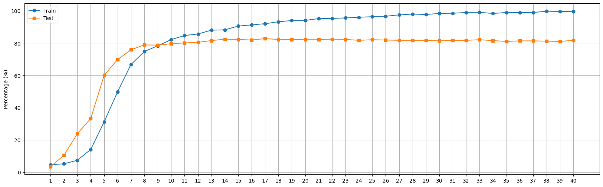
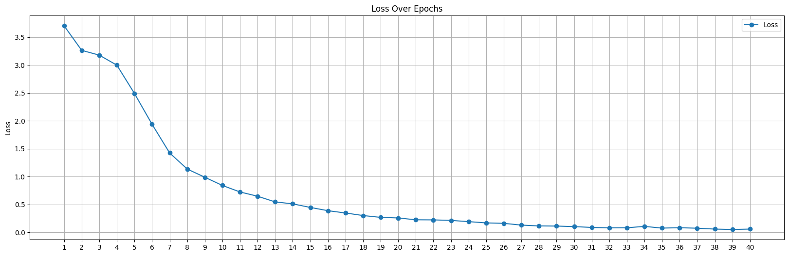

<div align="center">

# Resume Categorization
| Version Info | [](https://www.python.org/downloads/release/python-3913/) [](https://releases.ubuntu.com/20.04/) |
| ------------ | ---------------------------------------------------------------------------------------------------------------------------------------------------------------------------------------------------------------------------------------------------------- |
| Author       | [](https://www.linkedin.com/in/sourav-saha-3968031b8/) [](https://github.com/srv-sh)
---

</div>

## Overview
This project employs Machine Learning and Natural Language Processing to automatically categorize resumes. The aim is to create a script that categorizes resumes based on their content, streamlining the resume review process. The chosen model, BERT, is an advanced language model renowned for understanding context in text. By training BERT on resume data, the model learns to identify relevant features for different job categories. This approach offers efficient and accurate resume sorting, benefiting organizations in their recruitment efforts.

## Installation

#### Step 1: Clone this repository
```bash
git clone https://github.com/srv-sh/resume-categorization.git
cd resume-categorization
```
#### Step 2: Create virtual environment

*Conda environment:*
```
conda create -n rc python==3.9.0
conda activate rc
```
#### Step 3: Install dependencies

```bash
pip install -r requirements.txt
```
> Run the [`eda.ipynb`](eda.ipynb) file in jupyter notebook to get preprocessing steps, data augmentation, and exploratory data analysis.

> Run the [`model.ipynb`](model.ipynb) file in jupyter notebook to get the bert based multi-class classification model.


## Datasets
I utillized two kaggle dataset to train the model
1. https://www.kaggle.com/datasets/snehaanbhawal/resume-dataset (given)
2. https://www.kaggle.com/datasets/gauravduttakiit/resume-dataset (additional)

also i augmented few dataset to overcome overfitting issue

 in this [URL](https://drive.google.com/file/d/167VhIO7YLgg-p_aiguNkngFShOhpYnUe/view?usp=sharing) can be found the overall dataset which i used to train the model. 

 <!-- ## Files structure

| File Name        | Description |
| -----------      | ----------- |
| eda.ipynb        | This file contains preprocessing steps, data augmentation, and exploratory data analysis|
| model.ipynb      | This file contains code of model building and training steps        |
| script.py        | This file takes two parameters. one is ckpt file path and another one is data directory file path        |
|categorized_resumes.csv| This CSV file contains the file names of resumes corresponding to their predicted categories.| -->

 ## Inferance

 Firstly download the checkpoint from this [Link](https://drive.google.com/file/d/15YIT4aia3AiwraAJM20vtU3Pxikg0LoT/view?usp=sharing) and move it to the root directory.

 then run below script 

 ```bash
python script.py --ckpt <path/to/ckpt> --file_path <path/to/pdfs> 
```
For example:
 ```bash
python script.py --ckpt ./ckpt.pt --file_path ./pdf_files
```

> By running the script will create a folder named ```categorized_resume``` and  move the resumes from the ```file_path``` to the respective folders according to the category of the resume and will create a `categorize_resume.csv` file in the current directory.

## Training results
I have initially split the dataset into a training set and a test set using an 80:20 ratio. Subsequently, I observed that the training dataset was imbalanced. To address this imbalance, I performed data augmentation on a portion of the training data, resulting in a more balanced training set. However, it's important to note that the test dataset remained unchanged and was not subjected to any augmentation.
#### Below picture illustrating Train vs Test accuracy graph

#### Below picture illustrating the training loss graph


## Performance
I evaluated the performance of my model on a separate set of 563 samples that were not included in the training dataset. Below table presenting the evaluation table.

| evaluation metrics     | score       |
| -----------            | ----------- |
| Accuracy               | 83%         |
| Precision              | 83%         |
| recall                 | 83%         |
| F1                     | 82%         |